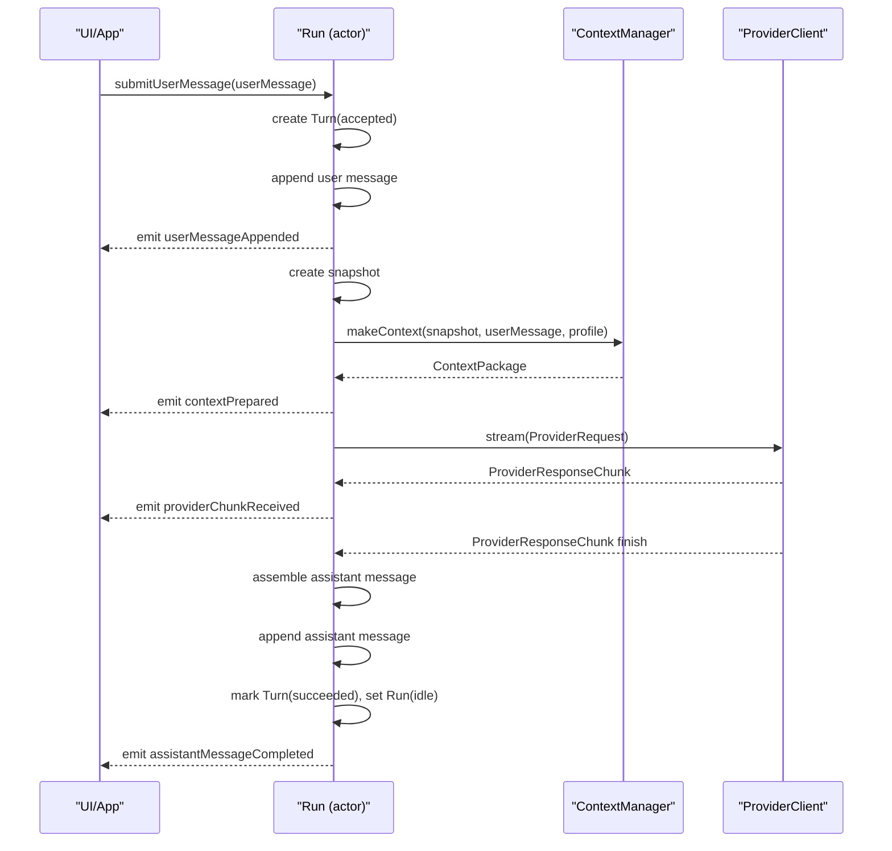
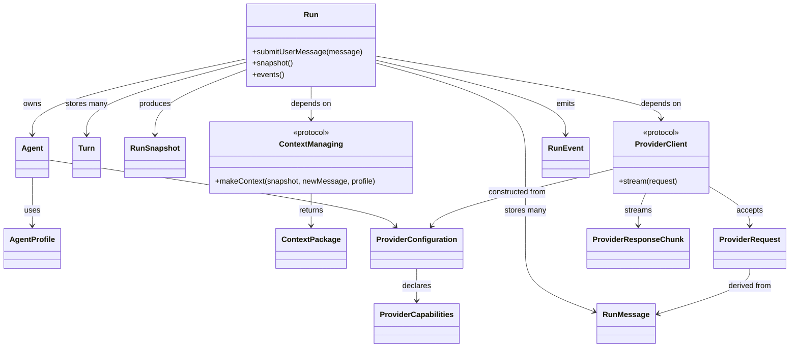

# 0002. Swift Kernel Baseline For Hephaestus

**Status:** Accepted
**Date:** 2026-04-20
**Deciders:** Joshua Sumskas, Codex
**Technical Story:** Establish the initial implementation baseline for the Hephaestus agent kernel and harness.

---

## Context

Hephaestus is intended to become a native macOS environment for building and inspecting agent systems. The project direction has been narrowed so that development starts with a single-agent kernel and grows into a competent agent harness before any multi-agent workflow layer is introduced.

The project already exists as a minimal SwiftUI macOS app scaffold. The next implementation work needs a stable baseline for language, runtime architecture, provider integration, and the first agent-loop milestone. Without these choices, detailed planning for the kernel and harness would be inconsistent and likely to drift.

### Background

Several constraints shape this decision:

- The app is natively macOS-first and already uses Swift and SwiftUI.
- The product should support OpenAI-compatible endpoints now, but should not be locked to one vendor or one exact wire format forever.
- The architecture should leave room for a custom backend later without requiring one for v1.
- The near-term product goal is not a workflow builder. It is a working agent kernel and then a competent single-agent harness with persistence, context management, skills, and tools.

### Problem Statement

Hephaestus needs a concrete implementation baseline so the first kernel milestone can be designed and built coherently.

### Goals

- Choose a primary implementation language and runtime model for v1.
- Define the architectural boundaries between UI, kernel, and infrastructure.
- Establish the provider boundary for OpenAI-compatible model backends.
- Fix the scope of the initial agent loop so implementation can proceed incrementally.

### Non-Goals

- Designing the full multi-agent workflow system.
- Committing to a custom backend for v1.
- Solving advanced context management, tools, and skills in this ADR beyond defining where they belong.

---

## Decision Drivers

* Fast iteration inside the existing native macOS app
* Clear runtime boundaries that support later expansion
* Flexibility to support multiple OpenAI-compatible backends
* Observability and debuggability of agent execution
* Avoiding premature complexity before the kernel is proven

---

## Considered Options

### Option 1: Swift-only Native Runtime

**Description:** Build the app, kernel, provider adapters, and local persistence in Swift inside the existing macOS application.

**Pros:**
- Fits the current macOS app with no cross-language integration cost.
- Simplifies UI integration, local persistence, and runtime observability.
- Allows the kernel to use Swift Concurrency and actors directly.
- Keeps the project small enough to validate the runtime quickly.

**Cons:**
- Limits reuse of existing agent ecosystem libraries from other languages.
- Defers any benefits of a separate backend process or service boundary.

### Option 2: Native UI With Separate Local Backend

**Description:** Keep the macOS app in SwiftUI but build the agent kernel in another language or process, such as Python or TypeScript.

**Pros:**
- Could reuse external agent tooling sooner.
- Introduces a clearer future service boundary from the start.

**Cons:**
- Adds IPC, packaging, and debugging complexity before the kernel is proven.
- Splits the development model across two runtimes too early.
- Slows down iteration on the first-turn lifecycle and local observability.

### Option 3: Backend-first Service Architecture

**Description:** Build the kernel as a remote or service-oriented backend first, with the macOS app acting mainly as a client.

**Pros:**
- Stronger long-term separation between frontend and runtime.
- Potentially easier to scale or share across multiple clients later.

**Cons:**
- Introduces infrastructure and distribution concerns that are not required for v1.
- Makes local-first development and inspection more complex.
- Pushes the project toward platform architecture before validating the kernel.

---

## Decision

Hephaestus will use a Swift-first, local-first implementation baseline for v1. The app, kernel, provider adapters, and initial persistence model will all live in the native macOS codebase as a modular monolith with strong internal boundaries.

**Chosen Option:** Option 1 - Swift-only Native Runtime

### Rationale

This choice best matches the current project state and the current product goal. The next milestone is to prove the kernel, not to solve service decomposition. A Swift-only runtime minimizes moving parts, keeps the feedback loop tight, and aligns with the existing SwiftUI app shell.

The architecture should still preserve future flexibility. The runtime will not be UI-shaped. Instead, it will be separated into application, kernel, and infrastructure layers so the kernel can later be moved behind a backend or reused by additional orchestration layers.

The provider boundary will be adapter-based. Internally, the runtime will use neutral message and event models. OpenAI-compatible endpoints will be treated as transport adapters, not the source of truth for runtime behavior. For the first milestone, the implementation should target broad `chat.completions`-style compatibility because it is the most common OpenAI-compatible surface.

The runtime model will be actor-oriented. The kernel should own one active turn per run, emit structured runtime events, and delegate context assembly to a separate context manager service rather than burying prompt construction inside provider code.

The first implementation milestone will be deliberately narrow: one agent, one run, one provider adapter, one context manager, and proof that two sequential turns work with continuity.

---

## Consequences

### Positive

- The first kernel can be implemented quickly inside the current app.
- Runtime state and events can be surfaced directly to the UI without cross-process plumbing.
- Future harness features such as persistence, skills, and tools have clear places to live.
- The project keeps the door open for future backend extraction because the provider and kernel boundaries are explicit.

### Negative

- Some future migration work may be required if the runtime later moves into a separate backend.
- Existing libraries from Python or TypeScript ecosystems will not be directly available in v1.
- The team must be disciplined about keeping the modular monolith boundaries clean.

### Neutral

- Multi-agent workflows are deferred until the single-agent harness is competent.
- Advanced context management is not solved here, but the architecture reserves a dedicated subsystem for it.
- Persistence can start minimal and expand without changing the core runtime contract.

---

## Implementation

The v1 baseline should be implemented with these boundaries:

- `UI/App`: SwiftUI views, user actions, and runtime observation.
- `Application`: run/session coordination and dependency wiring.
- `Kernel`: agent turn lifecycle, run state, context assembly contract, and event emission.
- `Infrastructure`: provider adapters, persistence, artifact storage, and future tool execution.

The kernel should define these early concepts:

- `Agent`
- `AgentProfile`
- `Run`
- `Turn`
- `RunMessage`
- `RunSnapshot`
- `ContextPackage`
- `ContextManager`
- `RunEvent`
- `RunEventStream`
- `ProviderConfiguration`
- `ProviderCapabilities`
- `ProviderClient`
- `ProviderRequest`
- `ProviderResponseChunk`

### Core Types And Interface Responsibilities

The following types and interfaces are part of the baseline architecture. They are not intended to freeze every final method signature, but they do define the minimum runtime contract that implementation should follow.

#### `Agent`

Represents one runnable agent identity in the harness.

It should contain:

- stable identifier
- display name
- profile reference
- provider configuration reference
- enabled skill or capability references later

`Agent` is the durable identity that a run executes against. `AgentProfile` is reusable behavior configuration. This distinction prevents the profile from becoming a mixed container for identity, runtime state, provider selection, skills, and policy.

Suggested initial shape:

- `id: UUID`
- `name: String`
- `profile: AgentProfile`
- `providerConfigurationID: String`
- `enabledSkillIDs: [String]`

#### `AgentProfile`

Represents the reusable behavior contract for one or more agents.

It should contain:

- stable identifier
- display name
- system instructions
- default model hint
- context policy identifier
- optional tool or capability policy

The profile is configuration, not runtime state.

Suggested initial shape:

- `id: UUID`
- `name: String`
- `systemPrompt: String`
- `defaultModel: String`
- `contextPolicyID: String`
- `toolPolicyID: String?`

Future additions such as safety policies or routing hints should extend this type only when they are part of reusable behavior. Agent-specific settings, provider choices, and enabled skills belong on `Agent`.

#### `Run`

Represents one long-lived conversation/session for one agent.

The initial implementation should treat `Run` as the owner of mutable runtime state for a conversation. In practice, this should likely be an `actor`.

`Run` is responsible for:

- storing ordered message history
- storing ordered turn history
- tracking conversation state such as idle, running, failed, and cancelled
- serializing turn execution so only one active turn runs at a time
- emitting `RunEvent`s as state changes occur

`Run` must not contain provider-specific wire logic.

`Run` is not completed after one assistant response. A successful turn returns the run to `idle` so another user message can be submitted in the same conversation.

Suggested initial shape:

- `id: UUID`
- `agent: Agent`
- `status: RunStatus`
- `messages: [RunMessage]`
- `turns: [Turn]`
- `activeTurnID: UUID?`
- `createdAt: Date`
- `updatedAt: Date`
- `lastError: RunError?`

Supporting types:

- `RunStatus`: `idle`, `running`, `failed`, `cancelled`
- `RunError`: normalized runtime error wrapper for provider, context, cancellation, and validation failures

#### `Turn`

Represents one user-submitted turn inside a run.

A turn starts when a user message is accepted and ends when the assistant response is completed, the request fails, or execution is cancelled.

It should contain:

- stable identifier
- parent run identifier
- status
- user message identifier
- assistant message identifier when completed
- context package identifier or trace reference when available
- provider request identifier when available
- timestamps
- error when failed

Suggested initial shape:

- `id: UUID`
- `runID: UUID`
- `status: TurnStatus`
- `userMessageID: UUID`
- `assistantMessageID: UUID?`
- `providerRequestID: UUID?`
- `createdAt: Date`
- `updatedAt: Date`
- `completedAt: Date?`
- `error: RunError?`

Supporting types:

- `TurnStatus`: `accepted`, `preparingContext`, `awaitingProvider`, `streaming`, `succeeded`, `failed`, `cancelled`

The run status and turn status are related but not identical. `RunStatus.running` means a turn is active. `TurnStatus.succeeded` means one turn finished successfully and the run should normally return to `idle`.

#### `RunMessage`

Represents a normalized message inside the runtime.

It should contain:

- stable identifier
- role such as system, user, assistant, tool
- content parts or normalized text payload
- timestamp
- provenance metadata when useful

This is the canonical internal message shape. Provider adapters translate to and from backend-specific formats from this model.

Suggested initial shape:

- `id: UUID`
- `role: MessageRole`
- `parts: [MessagePart]`
- `createdAt: Date`
- `source: MessageSource`
- `turnID: UUID?`

Supporting types:

- `MessageRole`: `system`, `user`, `assistant`, `tool`
- `MessagePart`: start with `.text(String)` and leave room for tool calls, citations, images, or structured payloads later
- `MessageSource`: identifies where the message came from, such as local user input, provider output, replay, or future inter-agent traffic
- `turnID`: links user and assistant messages to the turn that produced them

#### `RunSnapshot`

Represents an immutable view of run state passed to other services.

It should exist so the `ContextManager` and other services do not directly mutate or depend on the `Run` actor's internal storage shape.

It should contain at least:

- run identifier
- agent and profile reference
- current run status
- active turn if present
- ordered message history
- relevant artifact or summary references as they are added later

Suggested initial shape:

- `runID: UUID`
- `agent: Agent`
- `profile: AgentProfile`
- `status: RunStatus`
- `activeTurn: Turn?`
- `messages: [RunMessage]`
- `artifacts: [ArtifactReference]`
- `summaries: [SummaryReference]`
- `createdAt: Date`
- `updatedAt: Date`

The snapshot should be a read model, not a second mutable owner of runtime state.

#### `ContextPackage`

Represents the fully assembled prompt/context for a single model turn.

It should contain:

- resolved system instructions
- selected messages for the provider-intent context
- optional summaries or artifact references
- metadata describing how the package was assembled

The context package should be inspectable and explainable, even in the first version.

`ContextPackage.messages` is the final ordered runtime context for the provider request, excluding the synthetic system prompt and including the current user message exactly once. The current user message is identified by ID for inspection, but it is not stored as a second copy.

Suggested initial shape:

- `systemPrompt: String`
- `messages: [RunMessage]`
- `currentUserMessageID: UUID`
- `includedArtifacts: [ArtifactReference]`
- `includedSummaries: [SummaryReference]`
- `trace: ContextAssemblyTrace`

Supporting types:

- `ContextAssemblyTrace`: records why items were included, excluded, or truncated
- `ArtifactReference`: reference to external stored material without forcing raw payloads into the message history
- `SummaryReference`: reference to generated summaries used to compress history

#### `ContextManager`

Represents the subsystem that assembles a `ContextPackage` from a run snapshot and the current turn input.

The initial interface should conceptually support:

- accepting a `RunSnapshot`
- accepting the current inbound user message
- applying the profile's context policy
- returning a `ContextPackage`

This boundary is important because context logic is expected to grow substantially in later phases.

The v0 context policy should be deterministic:

- keep the system prompt as `ContextPackage.systemPrompt`
- include the most recent 20 non-system run messages by default
- include the current user message exactly once
- do not perform model-based summarization or token counting yet
- record included and excluded message IDs in `ContextAssemblyTrace`

The initial implementation can be simple, but the contract should already allow later insertion of:

- summary selection
- artifact retrieval
- budget enforcement
- skill-specific or profile-specific context shaping

#### `RunEvent`

Represents the structured event stream emitted by the runtime.

At minimum, the event model should support:

- run started
- user message appended
- turn status changed
- context assembled
- provider request started
- provider response chunk received
- assistant message completed
- run failed
- run cancelled

This event stream is the main observation boundary for the UI and later persistence/replay systems.

Suggested shape:

- define `RunEvent` as an enum with typed payloads rather than a loose log string
- every event includes `id`, `runID`, `turnID`, `sequence`, and `createdAt`
- provider events include `providerRequestID` when available
- message events include the relevant `messageID`

Suggested event cases:

- `runCreated`
- `userMessageAppended`
- `turnStatusChanged`
- `contextPrepared`
- `providerRequestStarted`
- `providerChunkReceived`
- `assistantMessageCompleted`
- `runFailed`
- `runCancelled`

`sequence` is monotonically increasing within a run. It is the ordering key for UI rendering, persistence, and replay.

#### `RunEventStream`

Represents the observation API for runtime events.

The run actor should expose an event stream so UI and later persistence can subscribe without reaching into mutable run internals.

Suggested initial shape:

- `events() -> AsyncStream<RunEvent>`

The stream should expose events from the point of subscription for v0. Durable replay from persisted events is a later persistence concern, but the event identity and sequence fields must be present from the start.

#### `ProviderConfiguration`

Represents backend configuration owned outside the kernel and passed into infrastructure when constructing a provider adapter.

It should contain:

- stable identifier
- provider display name
- base URL
- endpoint style
- auth reference
- default model
- capability declaration

Suggested initial shape:

- `id: String`
- `name: String`
- `baseURL: URL`
- `endpointStyle: ProviderEndpointStyle`
- `auth: ProviderAuth`
- `defaultModel: String`
- `capabilities: ProviderCapabilities`

Supporting types:

- `ProviderEndpointStyle`: start with `chatCompletions`
- `ProviderAuth`: start with bearer token ownership, with storage details handled outside this ADR

#### `ProviderCapabilities`

Represents the features a provider adapter can support.

It should contain:

- streaming support
- tool-call support later
- structured-output support later
- maximum context hint when known

Suggested initial shape:

- `supportsStreaming: Bool`
- `supportsToolCalls: Bool`
- `supportsStructuredOutput: Bool`
- `maxContextTokens: Int?`

#### `ProviderClient`

Represents the model backend adapter boundary.

The initial interface should conceptually support:

- accepting a normalized `ProviderRequest`
- returning streamed `ProviderResponseChunk`s
- surfacing provider failures through typed errors

The provider client is responsible for HTTP, auth, streaming, and wire translation. It is not responsible for run state or context selection.

The provider client should be created from a `ProviderConfiguration`. The run should depend on the `ProviderClient` protocol, not on configuration storage or secret storage.

#### `ProviderRequest`

Represents a normalized model invocation request sent by the kernel to a provider adapter.

It should contain:

- selected model identifier
- normalized message list
- stream flag
- optional tool definitions later
- request metadata useful for tracing and debugging

The request should be expressive enough to support OpenAI-compatible backends without baking their raw JSON shape into the kernel.

Suggested initial shape:

- `id: UUID`
- `runID: UUID`
- `turnID: UUID`
- `model: String`
- `messages: [ProviderMessage]`
- `stream: Bool`
- `metadata: ProviderRequestMetadata`

Supporting types:

- `ProviderMessage`: provider-facing normalized message translated from `RunMessage`
- `ProviderRequestMetadata`: request identifier, timestamps, and debug attributes useful for tracing

#### `ProviderResponseChunk`

Represents one streamed unit of provider output.

It should be able to carry:

- incremental assistant text or content parts
- finish state
- optional tool-call deltas later
- optional raw metadata for debugging

The kernel should be able to turn a stream of chunks into one final assistant message.

Suggested initial shape:

- `delta: ProviderDelta`
- `finishReason: ProviderFinishReason?`
- `rawMetadata: [String: String]?`
- `providerRequestID: UUID`

Supporting types:

- `ProviderDelta`: start with text deltas and leave room for structured content or tool-call deltas later
- `ProviderFinishReason`: normalized finish states such as stop, length, cancelled, or error

### Initial Runtime Invariants

The first implementation should preserve these invariants:

- one active turn at a time per `Run`
- the `Run` owns mutable runtime state
- the `ContextManager` does not call providers directly
- the `ProviderClient` does not mutate run state directly
- provider-specific wire formats do not leak into the UI layer
- every `RunEvent` has stable identity, run identity, turn identity when applicable, and a run-local sequence number
- the current user message appears exactly once in `ContextPackage.messages`
- a completed assistant response is appended to run history only after chunk assembly succeeds or the non-streamed response is finalized
- a successful turn returns the run to `idle`

### Type Interaction Diagram

The initial turn lifecycle should look like this:



Static ownership and dependency boundaries should look like this:



### Illustrative Shape

The exact signatures can change, but the implementation should stay close to a shape like this:

```swift
struct AgentProfile
struct Agent
struct Turn
struct RunMessage
struct RunSnapshot
struct ContextPackage
struct ProviderConfiguration
struct ProviderCapabilities
struct ProviderRequest
struct ProviderResponseChunk
enum RunEvent

protocol ContextManaging {
    func makeContext(
        for snapshot: RunSnapshot,
        newMessage: RunMessage,
        profile: AgentProfile
    ) async throws -> ContextPackage
}

protocol ProviderClient {
    func stream(
        request: ProviderRequest
    ) -> AsyncThrowingStream<ProviderResponseChunk, Error>
}

actor Run {
    func submitUserMessage(_ message: RunMessage) async throws
    func snapshot() async -> RunSnapshot
    nonisolated func events() -> AsyncStream<RunEvent>
}
```

### Migration Path

Replace the current template app model incrementally:

1. Remove or ignore the placeholder item-list domain model.
2. Introduce the kernel types and an in-memory run implementation.
3. Add one OpenAI-compatible provider adapter.
4. Prove the initial two-turn loop.
5. Expand into persistence, stronger context management, skills, and tools.

### Timeline

This ADR applies immediately and should govern the first kernel implementation milestone.

---

## Validation

This decision is correct if the project can implement the initial kernel without architecture churn and then expand that kernel into a competent single-agent harness.

### Success Metrics

- A single agent can complete two sequential turns in one run with continuity.
- The runtime emits structured events for request and response lifecycle.
- Provider integration works through an internal adapter boundary rather than direct view-level calls.
- Phase 3 single-agent harness features can be added without redesigning the kernel.

### Monitoring

Monitor whether implementation work starts to leak provider details into view code, or whether features such as persistence and context management require rewriting the run lifecycle. Either would indicate the boundaries in this ADR are not being upheld strongly enough.

---

## Related Decisions

- Future ADR: internal runtime state machine for the initial agent loop
- Future ADR: persistence model for runs, artifacts, and chats
- Future ADR: context management pipeline and memory model

---

## References

- [Vision](../vision.md)
- [Roadmap](../roadmap.md)
- [Next Step](../next-step.md)

---

## Notes

This ADR intentionally fixes only the baseline. It does not lock the project into a permanent single-process design, nor does it commit the runtime to one provider wire format beyond the first compatibility target.

**Last Updated:** 2026-04-25
