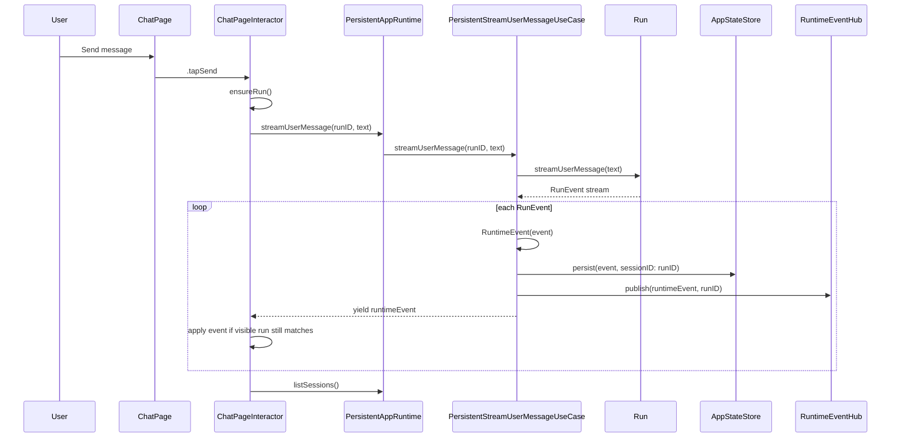
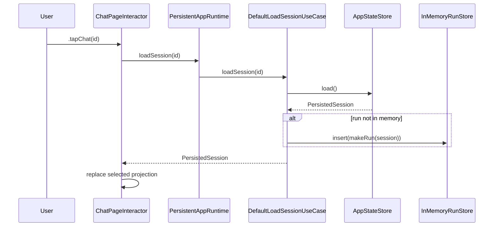
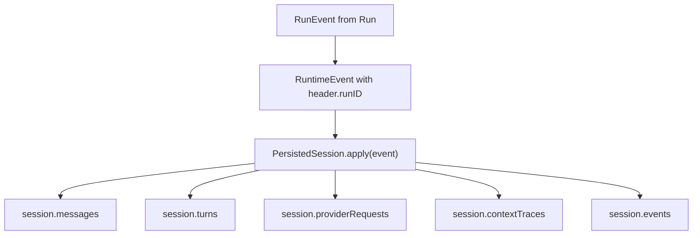
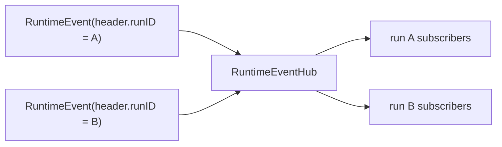
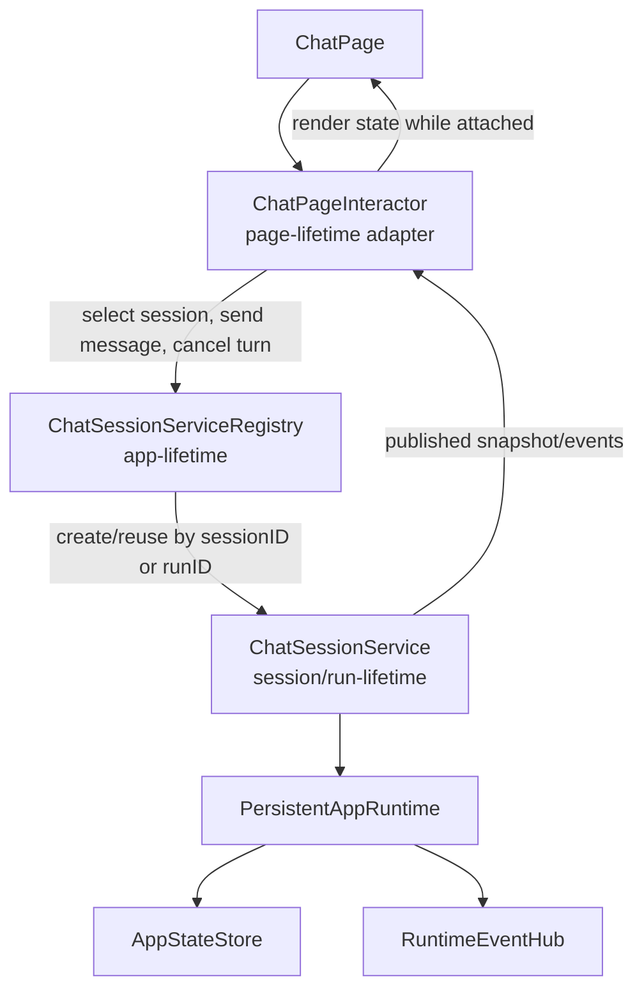
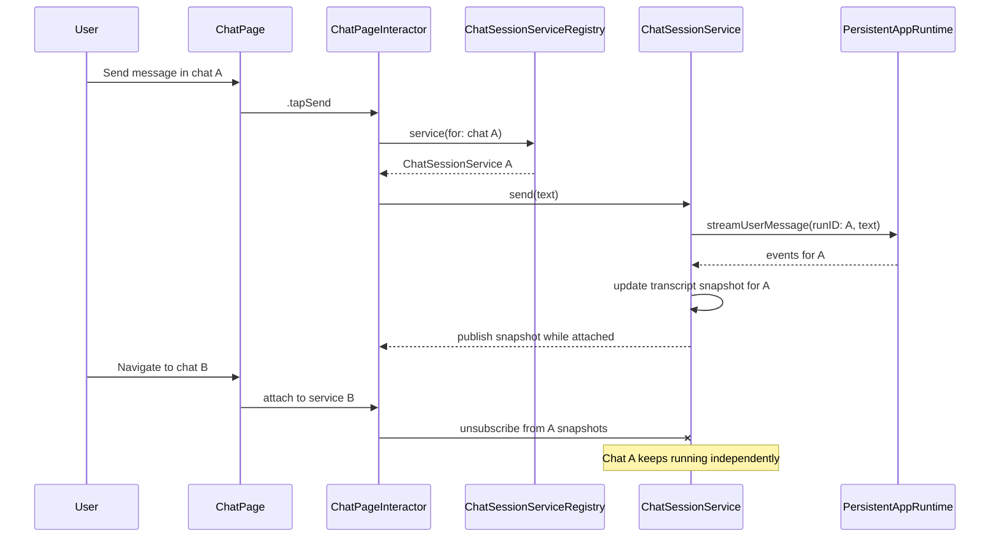

# Chat Log Runtime Architecture Map

**Status:** Current-state map
**Date:** 2026-04-27
**Related PRDs:** [PRD-0004](../prd/0004-persistent-chats-and-runs.md), [PRD-0005](../prd/0005-context-management-v1.md), [PRD-0006](../prd/0006-run-inspection.md), [PRD-0007](../prd/0007-chat-experience-ux-v1.md)
**Related ADRs:** [ADR-0004](../adr/0004-swiftui-interactor-page-architecture.md), [ADR-0007](../adr/0007-headless-runtime-entrypoint.md), [ADR-0008](../adr/0008-local-app-state-storage.md)

## Purpose

This document maps the current chat log, runtime event, persistence, and UI projection flow. It is not a new architecture decision. It exists to make the current seams visible before the chat subsystem grows further.

The short version: the runtime is run-keyed, the persisted state is session-keyed, and the SwiftUI page currently renders one mutable selected-session projection. Recent bugs came from that selected projection being updated by work that belonged to a different run.

## Current Components

| Component | Package / File | Responsibility |
| --- | --- | --- |
| `ChatPage` | `Features/ChatFeature/.../ChatFeature.swift` | Renders the sidebar, selected transcript, composer, provider settings, and inspector. |
| `ChatPageInteractor` | `Features/ChatFeature/.../ChatFeature.swift` | Owns current page state and translates UI actions into runtime use-case calls. |
| `PersistentAppRuntime` | `Hephaestus/HephaestusAppShell.swift` | App-level adapter that exposes runtime use cases to the route context and lazily builds the active runtime harness. |
| `PersistentRuntimeHarness` | `Core/HephaestusComposition/.../RuntimeComposition.swift` | Composes store, run store, provider, event hub, and persistent use cases. |
| `Run` | `Core/HephaestusKernel/.../Kernel.swift` | In-memory turn executor for one agent conversation. Emits `RunEvent`s. |
| `PersistentStreamUserMessageUseCase` | `Core/HephaestusRuntime/.../PersistentRuntimeUseCases.swift` | Converts run events into runtime events, persists them to the matching session, and publishes them. |
| `RuntimeEventHub` | `Core/HephaestusRuntime/.../Runtime.swift` | In-memory pub/sub keyed by `runID`. |
| `AppStateStore` / `PersistedSession` | `Core/HephaestusRuntime/.../AppStateStorage.swift` | Durable provider settings, sessions, messages, turns, provider request summaries, context traces, and runtime event summaries. |

## Data Model Split

There are three related but distinct concepts:

| Concept | Identifier | Lives In | Notes |
| --- | --- | --- | --- |
| Runtime run | `runID` | `Run`, `InMemoryRunStore`, `RuntimeEventHeader` | The active execution identity. For persisted chats, this is the same UUID as the session ID. |
| Persisted session | `PersistedSession.id` | `AppStateStore` | Durable chat log and inspection record. |
| Selected UI projection | `ChatPageState.runID` + `ChatPageState.messages` | `ChatPageInteractor` | The visible transcript. This is a projection, not the source of truth. |

This split is useful, but it is also where the recent cross-chat streaming bug came from. Runtime events were correctly tagged with `runID`, but the UI applied them to whichever `ChatPageState.messages` happened to be visible.

## Main Send Flow



Important details:

- `Run.streamUserMessage` emits turn lifecycle events in order: user accepted, context prepared, provider request prepared, provider chunks, assistant completed, or failure/cancel.
- `PersistentStreamUserMessageUseCase` persists every yielded event before yielding it back to the UI stream.
- `RuntimeEventHub` also publishes the event by `runID`, but the current chat page does not use a long-lived subscription for its visible transcript. It consumes the stream returned by the send call.

## Session Loading Flow



Session selection should be exposed as the user intent `tapChat(id)`. If loading a persisted session is required, that should be a private interactor helper or service call behind the action, not the action name itself. Session selection should not refresh the whole sidebar list. It only needs to load and render the selected session. Sidebar refreshes are currently appropriate after initial page load, new chat creation, and send completion because those can change ordering, title, or message counts.

## Persistence Flow



`PersistedSession.apply` is event sourced in spirit, but not fully event sourced in implementation. It appends a compact persisted event record and mutates read models in the same step.

Current persisted projections:

- `messages`: user and assistant messages for transcript reload.
- `turns`: turn status and IDs.
- `providerRequests`: model, message count, system prompt inclusion, stream flag.
- `contextTraces`: included/excluded message IDs and message limit.
- `events`: ordered summaries for inspection.

## Runtime Event Subscription Model

`RuntimeEventHub` supports run-keyed subscriptions:



The current `ChatPageInteractor` is mostly request/response streaming:

- It calls `streamUserMessage`.
- It consumes that returned stream.
- It mutates the selected visible transcript directly.

The current page does not maintain an `observeRunEvents` subscription for the selected chat. That makes the code simple, but it also means that visible transcript state and persisted session state can diverge until the session is reloaded.

## Interactor Lifecycle Mismatch

`ChatPageInteractor` is currently doing work that outlives the page lifecycle:

- it starts the send operation,
- it consumes the returned stream,
- it accumulates live transcript state,
- it owns the selected page's `isRunning` and error state, and
- it refreshes session summaries after the operation completes.

That is too much ownership for an interactor that is naturally tied to a SwiftUI page. The page can disappear, be replaced, or eventually be deallocated while chat IO is still running. The durable behavior should belong to an app-lifetime or session-lifetime service, not to a view-lifetime adapter.

The interactor should be allowed to disappear without cancelling or corrupting a chat unless the user explicitly cancels that chat's active turn.

## Proposed Service Boundary

The next architecture should introduce a persistent service layer keyed by chat session or run. The page interactor attaches to that service while visible and detaches when the page disappears.



Suggested ownership:

| Component | Lifetime | Responsibility |
| --- | --- | --- |
| `ChatSessionServiceRegistry` | App lifetime | Creates, reuses, and eventually evicts per-chat services. Keeps chat work independent of page objects. |
| `ChatSessionService` | Session/run lifetime | Owns chat IO tasks, active turn state, transcript projection, runtime event routing, persistence reconciliation, and per-chat errors. |
| `ChatPageInteractor` | Page lifetime | Sends UI intents to the selected service, subscribes to service snapshots while visible, and maps snapshots into page state. |
| `ChatPageState` | Page render state | Represents current navigation and the latest snapshot from the attached service. It should not be the authoritative chat log. |
| `PersistentAppRuntime` | App/runtime lifetime | Provides runtime use cases and storage-backed behavior. It should not know about SwiftUI page lifecycle. |

This changes the control model:



The important property is that a response for chat A can complete while no page is attached to chat A. The service persists and caches the result, and the next interactor that attaches to chat A receives the current snapshot.

## Current Safety Rules

These rules are now required for correctness:

1. Runtime events must be tagged with the run they belong to.
2. Persistence must write events to the session matching that run.
3. UI stream application must verify the visible selected run still matches the submitted run.
4. Switching chats replaces the selected projection from persisted session data.
5. Opening a selected chat must be a no-op.
6. Opening a different chat must not refresh the whole sidebar list.

## Recent Bug Class

### Cross-Chat Streaming Leak

Symptom: send a message in chat A, switch to chat B while the response is in flight, then chat A's delayed response appears in chat B.

Cause: the stream belonged to chat A, but `ChatPageInteractor.apply` mutated `ChatPageState.messages`, which represented the currently selected chat. It did not verify `event.header.runID`.

Current patch: `apply(event, visibleRunID:)` only mutates visible transcript state when both `state.runID` and `event.header.runID` match the submitted run.

### Sidebar Loading Jump

Symptom: selecting a chat made the sidebar briefly jump into loading.

Cause: `handleOpenSession` called `refreshSessions()`, which flips `isLoadingSessions` for the entire sidebar.

Current patch: opening a session only loads that session. Sidebar refresh is reserved for initial load and list-changing actions.

## Architecture Risks

These are not necessarily urgent defects, but they are revision candidates before the project gets deeper.

### Interactor Owns Long-Lived Chat Work

The biggest current risk is that the interactor owns stream consumption and live transcript mutation. That couples chat execution to page lifetime and will grow the interactor into a large coordination object as provider IO, context management, retries, cancellation, attachments, tools, and runtime inspection become richer.

Revision candidate: move per-chat execution and live transcript ownership into `ChatSessionService`. The interactor should only attach, detach, and forward UI commands.

### One Selected Projection Is Doing Too Much

`ChatPageState.messages` is both:

- the visible selected transcript, and
- the transient live stream accumulator.

That works for one chat, but becomes fragile when multiple sessions can have in-flight turns.

Revision candidate: introduce a UI-side session cache keyed by `runID`, for example:

```swift
struct ChatPageState {
    var selectedRunID: UUID?
    var sessions: [ChatSessionSummaryState]
    var transcripts: [UUID: ChatTranscriptState]
}
```

Then events update `transcripts[event.header.runID]`, and the page renders `transcripts[selectedRunID]`.

If we introduce `ChatSessionService`, this cache should probably live in the service layer rather than inside `ChatPageInteractor`.

### No First-Class In-Flight Turn Model In UI

`isRunning` is global to the selected page. It cannot represent "chat A is still responding while chat B is selected."

Revision candidate: make in-flight status per session:

```swift
struct ChatTranscriptState {
    var messages: [ChatMessageState]
    var activeTurnID: UUID?
    var isRunning: Bool
    var errorMessage: String?
}
```

The sidebar could then show a subtle per-chat activity indicator without hijacking the selected chat.

### Returned Stream And EventHub Overlap

There are two event delivery paths:

- direct stream returned from `streamUserMessage`
- pub/sub stream from `observeRunEvents`

The current page uses the direct stream. This is fine for simple send handling, but it does not give the UI a unified model for background updates, multiple active chats, or reconnect/reload behavior.

Revision candidate: pick one primary UI update model:

- command starts a turn, then a persistent chat service observes events by run ID and publishes snapshots; or
- command returns a stream to the persistent chat service, and the service owns stream task routing by run ID.

Both options are workable if the service is the owner. Returning a stream directly to a page interactor is the path to avoid.

### Persistence Updates Whole App State Per Event

`PersistentStreamUserMessageUseCase.persist` loads and saves app state for every event. That is simple and testable, but streaming token-level events could create high write frequency if persisted at chunk granularity.

Current implementation stores chunk events in the ordered event log and updates turn state, while final assistant content is persisted when the assistant message completes.

Revision candidate: throttle or coalesce stream chunk persistence if provider chunks become frequent or app-state files grow quickly.

### Session List Is Pull-Based

The sidebar list is refreshed by explicit calls. This means each action must remember whether it changed session summary data.

Revision candidate: introduce a session-summary publisher or store observation layer. That would reduce manual `refreshSessions()` calls and avoid list refreshes in read-only flows.

## Recommended Next Architecture Step

Before adding more chat UX or multi-agent behavior, decide the persistent chat service boundary.

Recommended direction:

1. Keep the runtime and persistence run-keyed/session-keyed model.
2. Add an app-lifetime `ChatSessionServiceRegistry`.
3. Add a session/run-lifetime `ChatSessionService` that owns chat IO, in-flight turn state, transcript projection, error state, cancellation, and runtime event application.
4. Make `ChatPageInteractor` a page-lifetime adapter that subscribes to the selected service and forwards user intents.
5. Treat selected chat ID as navigation state only.
6. Decide whether `ChatSessionService` consumes direct command streams or uses `observeRunEvents` as the primary update path.
7. Define service eviction and recovery rules so long-running chats can survive page disappearance without leaking memory indefinitely.

This is now ADR-sized. The decision changes ownership boundaries and lifecycle expectations, not just implementation details.

The implementation sequence is tracked in [Chat Session Service Refactor Plan](./0006-chat-session-service-refactor-plan.md).

## ADR Candidate

Title: `Persistent Chat Session Service And UI Subscription Boundary`

The ADR should decide:

1. Whether per-chat services are actors, `@MainActor` observable reference types, or a split between a background actor and main-actor snapshot publisher.
2. Whether the primary event path is direct command streams, `RuntimeEventHub.observeRunEvents`, or a hybrid where commands return task identity and services subscribe to events.
3. How services are keyed: persisted session ID, runtime run ID, or a dedicated chat instance ID.
4. How services are created, retained, and evicted by the app shell.
5. How cancellation behaves when a page disappears versus when the user explicitly stops a chat.
6. How persisted state and in-memory snapshots reconcile after app restart or service eviction.
