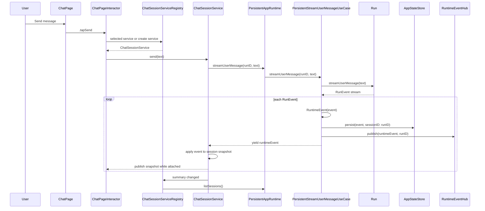
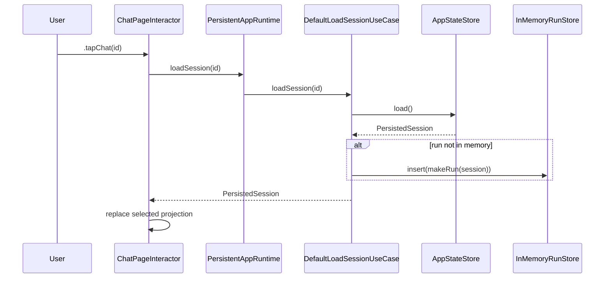
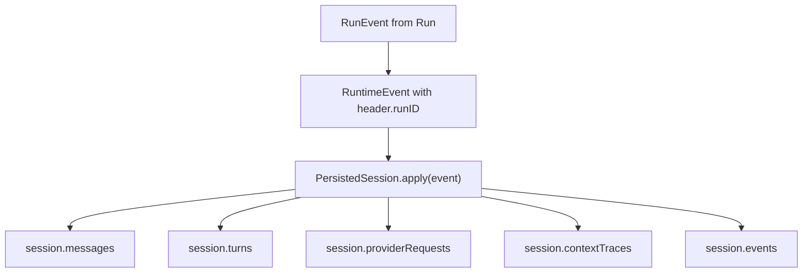
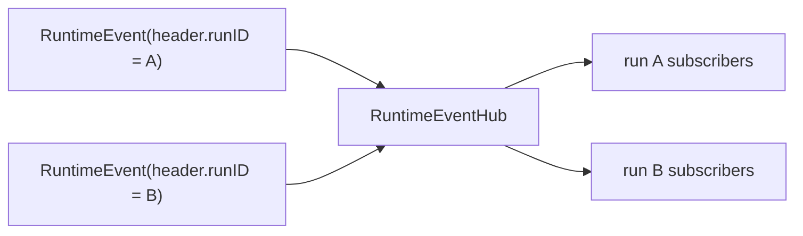
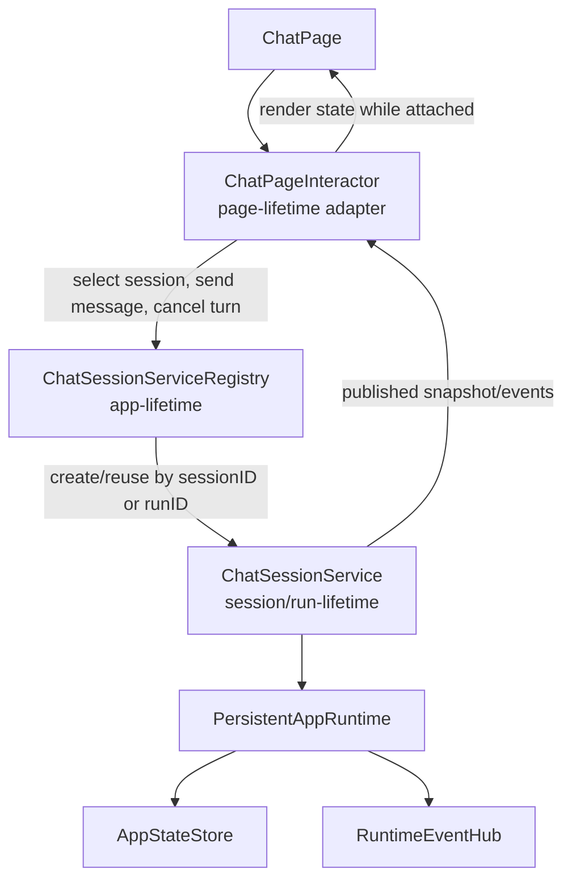
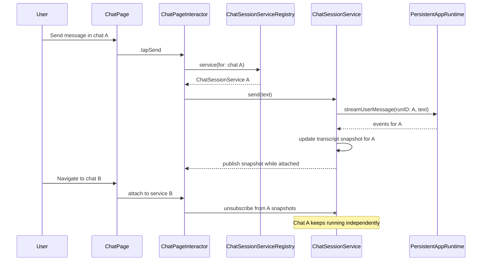

# Chat Log Runtime Architecture Map

**Status:** Current service-flow map
**Date:** 2026-04-27
**Related PRDs:** [PRD-0004](../prd/0004-persistent-chats-and-runs.md), [PRD-0005](../prd/0005-context-management-v1.md), [PRD-0006](../prd/0006-run-inspection.md), [PRD-0007](../prd/0007-chat-experience-ux-v1.md)
**Related ADRs:** [ADR-0004](../adr/0004-swiftui-interactor-page-architecture.md), [ADR-0007](../adr/0007-headless-runtime-entrypoint.md), [ADR-0008](../adr/0008-local-app-state-storage.md), [ADR-0009](../adr/0009-persistent-chat-session-service.md)

## Purpose

This document maps the current chat log, runtime event, persistence, service, and UI projection flow. It is not a new architecture decision. It exists to keep the current seams visible as the chat subsystem grows.

The short version: the runtime is run-keyed, persisted state is session-keyed, and the SwiftUI page now renders the latest snapshot from a per-chat service selected through an app-lifetime registry. Runtime stream ownership moved out of `ChatPageInteractor`.

## Current Components

| Component | Package / File | Responsibility |
| --- | --- | --- |
| `ChatPage` | `Features/ChatFeature/.../ChatFeature.swift` | Renders the sidebar, selected transcript, composer, provider settings, and inspector. |
| `ChatPageInteractor` | `Features/ChatFeature/.../ChatFeature.swift` | Owns current page render state, attaches/detaches selected service snapshots, and forwards user intents. |
| `ChatSessionServiceRegistry` | `Features/ChatFeature/.../ChatSessionService.swift` | App-lifetime factory/cache for per-chat services and sidebar summary state. |
| `ChatSessionService` | `Features/ChatFeature/.../ChatSessionService.swift` | Session/run-lifetime owner of chat IO tasks, runtime event application, live transcript snapshots, and explicit cancellation. |
| `PersistentAppRuntime` | `Hephaestus/HephaestusAppShell.swift` | App-level adapter that exposes runtime use cases to the route context and lazily builds the active runtime harness. |
| `PersistentRuntimeHarness` | `Core/HephaestusComposition/.../RuntimeComposition.swift` | Composes store, run store, provider, event hub, and persistent use cases. |
| `Run` | `Core/HephaestusKernel/.../Kernel.swift` | In-memory turn executor for one agent conversation. Emits `RunEvent`s. |
| `PersistentStreamUserMessageUseCase` | `Core/HephaestusRuntime/.../PersistentRuntimeUseCases.swift` | Converts run events into runtime events, persists them to the matching session, and publishes them. |
| `RuntimeEventHub` | `Core/HephaestusRuntime/.../Runtime.swift` | In-memory pub/sub keyed by `runID`. |
| `AppStateStore` / `PersistedSession` | `Core/HephaestusRuntime/.../AppStateStorage.swift` | Durable provider settings, sessions, messages, turns, provider request summaries, context traces, and runtime event summaries. |

## Data Model Split

There are three related but distinct concepts:

| Concept | Identifier | Lives In | Notes |
| --- | --- | --- | --- |
| Runtime run | `runID` | `Run`, `InMemoryRunStore`, `RuntimeEventHeader` | The active execution identity. For persisted chats, this is the same UUID as the session ID. |
| Persisted session | `PersistedSession.id` | `AppStateStore` | Durable chat log and inspection record. |
| Selected UI projection | `ChatPageState.runID` + `ChatPageState.selectedSnapshot` | `ChatPageInteractor` | The visible transcript projection from the selected service snapshot. |

This split is useful, but it is also where the recent cross-chat streaming bug came from. Runtime events were correctly tagged with `runID`, but the UI applied them to whichever `ChatPageState.messages` happened to be visible.

## Main Send Flow

Important details:

- `Run.streamUserMessage` emits turn lifecycle events in order: user accepted, context prepared, provider request prepared, provider chunks, assistant completed, or failure/cancel.
- `PersistentStreamUserMessageUseCase` persists every yielded event before yielding it back to the UI stream.
- `RuntimeEventHub` also publishes the event by `runID`, but the current chat page does not use a long-lived subscription for its visible transcript. It consumes the stream returned by the send call.

## Session Loading Flow

Session selection should be exposed as the user intent `tapChat(id)`. If loading a persisted session is required, that should be a private interactor helper or service call behind the action, not the action name itself. Session selection should not refresh the whole sidebar list. It only needs to load and render the selected session. Sidebar refreshes are currently appropriate after initial page load, new chat creation, and send completion because those can change ordering, title, or message counts.

## Persistence Flow

`PersistedSession.apply` is event sourced in spirit, but not fully event sourced in implementation. It appends a compact persisted event record and mutates read models in the same step.

Current persisted projections:

- `messages`: user and assistant messages for transcript reload.
- `turns`: turn status and IDs.
- `providerRequests`: model, message count, system prompt inclusion, stream flag.
- `contextTraces`: included/excluded message IDs and message limit.
- `events`: ordered summaries for inspection.

## Runtime Event Subscription Model

`RuntimeEventHub` supports run-keyed subscriptions:

The current `ChatSessionService` is request/response streaming:

- it calls `streamUserMessage`,
- it consumes the returned stream,
- it mutates the per-chat snapshot, and
- it publishes snapshots to any attached page interactor.

The page does not maintain an `observeRunEvents` subscription. The service is now the long-lived owner of the direct stream path.

## Interactor Lifecycle Mismatch

`ChatPageInteractor` is page-lifecycle scoped:

- it forwards `.tapSend`, `.tapChat`, `.tapNewChat`, and `.tapCancel`,
- it subscribes to the selected service while visible,
- it detaches on page disappearance, and
- it keeps provider settings and inspector presentation page-local.

The interactor can disappear without cancelling or corrupting a chat. Explicit cancel is routed to the selected service.

## Service Boundary

The next architecture should introduce a persistent service layer keyed by chat session or run. The page interactor attaches to that service while visible and detaches when the page disappears.

Suggested ownership:

| Component | Lifetime | Responsibility |
| --- | --- | --- |
| `ChatSessionServiceRegistry` | App lifetime | Creates, reuses, and eventually evicts per-chat services. Keeps chat work independent of page objects. |
| `ChatSessionService` | Session/run lifetime | Owns chat IO tasks, active turn state, transcript projection, runtime event routing, persistence reconciliation, and per-chat errors. |
| `ChatPageInteractor` | Page lifetime | Sends UI intents to the selected service, subscribes to service snapshots while visible, and maps snapshots into page state. |
| `ChatPageState` | Page render state | Represents current navigation and the latest snapshot from the attached service. It should not be the authoritative chat log. |
| `PersistentAppRuntime` | App/runtime lifetime | Provides runtime use cases and storage-backed behavior. It should not know about SwiftUI page lifecycle. |

The current control model:

The important property is that a response for chat A can complete while no page is attached to chat A. The service persists and caches the result, and the next interactor that attaches to chat A receives the current snapshot.

## Current Safety Rules

These rules are now required for correctness:

1. Runtime events must be tagged with the run they belong to.
2. Persistence must write events to the session matching that run.
3. Runtime event application must happen inside the matching `ChatSessionService`.
4. Switching chats detaches the old service subscription and attaches to the newly selected service snapshot.
5. Opening a selected chat must be a no-op.
6. Opening a different chat must not refresh the whole sidebar list.

## Recent Bug Class

### Cross-Chat Streaming Leak

Symptom: send a message in chat A, switch to chat B while the response is in flight, then chat A's delayed response appears in chat B.

Cause: the stream belonged to chat A, but the page interactor mutated `ChatPageState.messages`, which represented whichever chat was currently selected.

Current fix: `ChatSessionService` owns runtime event application for one run/session, and `ChatPageInteractor` only observes the selected service snapshot while attached.

### Sidebar Loading Jump

Symptom: selecting a chat made the sidebar briefly jump into loading.

Cause: session selection refreshed the whole sidebar list, flipping the list into loading even though selection only needed the target session snapshot.

Current fix: opening a session attaches to the target service without refreshing summaries. Sidebar summary loading is owned by `ChatSessionServiceRegistry`.

## Architecture Risks

These are not necessarily urgent defects, but they are revision candidates before the project gets deeper.

### One Selected Projection Is Doing Too Much

`ChatPageState.messages` is still the render-friendly visible transcript, but it is now copied from:

- `ChatPageState.selectedSnapshot`, and
- the selected `ChatSessionService` snapshot stream.

The authoritative live projection is service-owned. Future UI work should prefer rendering directly from richer snapshot fields instead of adding new authoritative page caches.

### Sidebar Does Not Yet Show Per-Chat Activity

`ChatSessionService` tracks running state per selected service, but the sidebar summary row does not yet show "chat A is still responding while chat B is selected."

Revision candidate: add per-chat activity metadata to summary state, sourced from the registry/service cache rather than the page interactor.

### Direct Stream And EventHub Overlap

There are two event delivery paths:

- direct stream returned from `streamUserMessage`
- pub/sub stream from `observeRunEvents`

`ChatSessionService` currently owns the direct stream path. This is correct for the implemented slice, but it still means background updates that do not originate from a service command would need an additional observation path.

Revision candidate: if future runtime work can produce events independently of a service command, add a service-owned `observeRunEvents` subscription without reintroducing page-level runtime event handling.

### Persistence Updates Whole App State Per Event

`PersistentStreamUserMessageUseCase.persist` loads and saves app state for every event. That is simple and testable, but streaming token-level events could create high write frequency if persisted at chunk granularity.

Current implementation stores chunk events in the ordered event log and updates turn state, while final assistant content is persisted when the assistant message completes.

Revision candidate: throttle or coalesce stream chunk persistence if provider chunks become frequent or app-state files grow quickly.

### Session List Is Pull-Based

The registry publishes summary state, but it still refreshes by calling `listSessions()` after known list-changing or summary-changing actions.

Revision candidate: introduce a storage-level session-summary publisher so the registry can react to state changes without manual refresh triggers.

## Implemented Architecture Step

The persistent chat service boundary was accepted in [ADR-0009](../adr/0009-persistent-chat-session-service.md) and implemented in [Chat Session Service Refactor Plan](./0006-chat-session-service-refactor-plan.md).

The current direction is:

1. Keep the runtime and persistence run-keyed/session-keyed model.
2. Use an app-lifetime `ChatSessionServiceRegistry`.
3. Use a session/run-lifetime `ChatSessionService` for chat IO, in-flight turn state, transcript projection, error state, cancellation, and runtime event application.
4. Keep `ChatPageInteractor` as a page-lifetime adapter that subscribes to the selected service and forwards user intents.
5. Treat selected chat ID as navigation state only.
6. Keep direct stream consumption inside `ChatSessionService` for now.
7. Defer service eviction until there is concrete pressure to add it.
