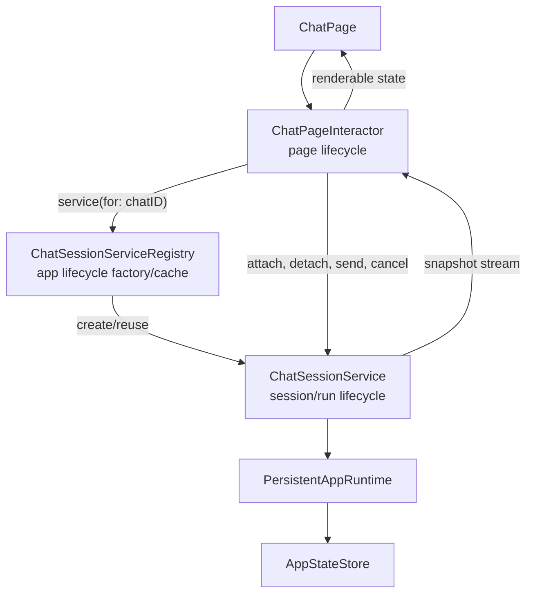
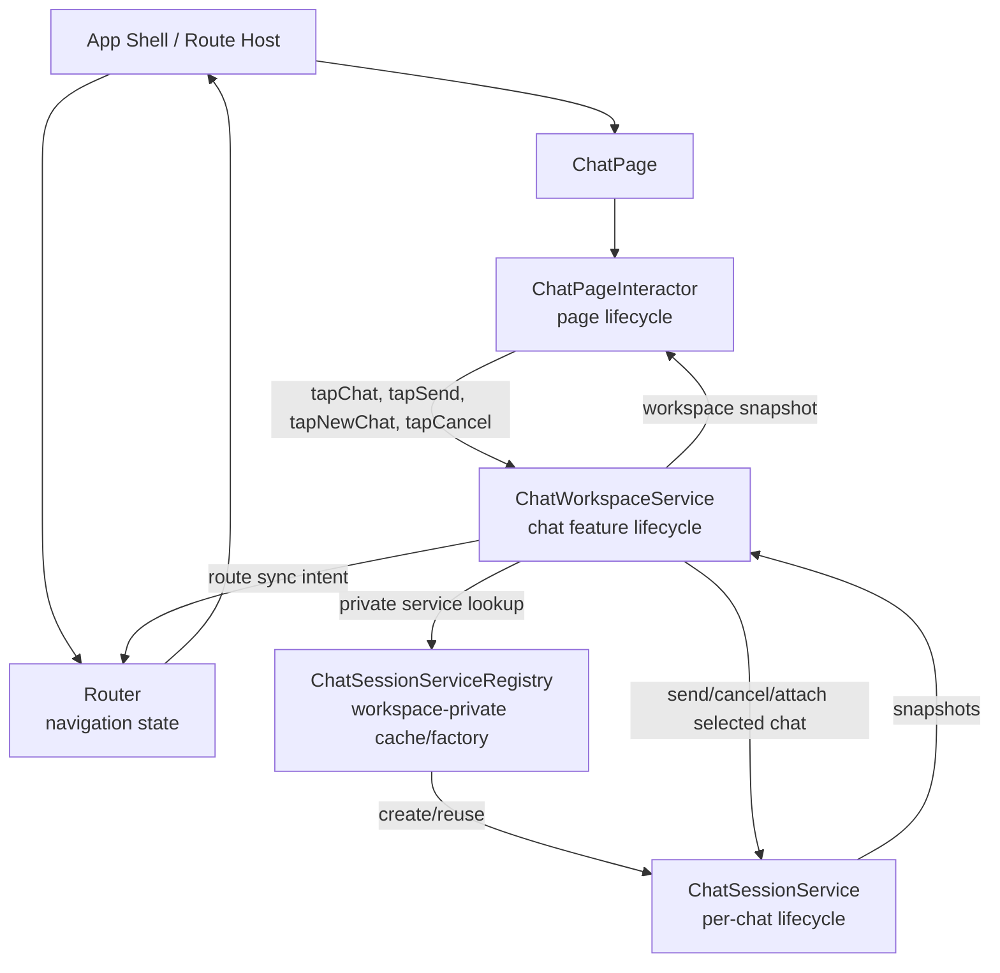
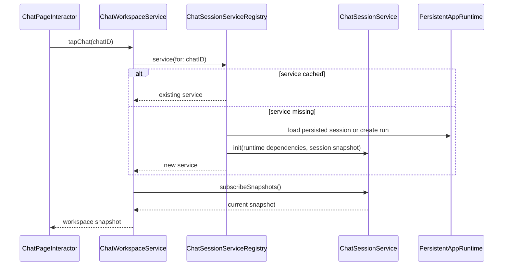

# Chat Session Service Refactor Plan

**Status:** Implemented
**Date:** 2026-04-27
**Related Architecture Map:** [Chat Log Runtime Architecture Map](./0005-chat-log-runtime-architecture-map.md)
**Related ADRs:** [ADR-0004](../adr/0004-swiftui-interactor-page-architecture.md), [ADR-0007](../adr/0007-headless-runtime-entrypoint.md), [ADR-0008](../adr/0008-local-app-state-storage.md), [ADR-0009](../adr/0009-persistent-chat-session-service.md)

## Purpose

This plan records how to refactor chat execution so page interactors stay tied to the SwiftUI view lifecycle while chat IO and per-chat state live in a persistent service layer.

Before this refactor, `ChatPageInteractor` was doing too much: it started runtime work, consumed streams, applied runtime events to the visible transcript, owned running/error state, and reloaded session summaries. That was enough for the first chat UI, but it was the wrong ownership boundary for persistent multi-chat behavior.

## Required Architecture Decision

Completed in [ADR-0009: Persistent Chat Session Service And UI Subscription Boundary](../adr/0009-persistent-chat-session-service.md).

The ADR decided:

1. Per-chat services are `@MainActor` reference types for this slice.
2. Services consume direct `streamUserMessage` streams and own event application.
3. Services are keyed by persisted session ID, which is also the runtime run ID for persistent chats.
4. `ChatSessionServiceRegistry` is app-lifetime and injected into route-built page interactors.
5. Services are retained for the app lifetime; eviction is deferred.
6. Page disappearance detaches subscriptions only; explicit cancel cancels the selected service's active send task.
7. Missing services are rebuilt from persisted sessions through `LoadSessionUseCase`.

## Target Shape



The registry is a factory/cache, not a command facade. The interactor asks the registry for the currently selected chat service, then sends chat commands to that service. This keeps command ownership on the per-chat object and avoids splitting behavior between the registry and the service.

## Next Refinement: Chat Workspace Service

The implemented shape still exposes `ChatSessionServiceRegistry` to `ChatPageInteractor`. That was a useful step for moving stream ownership out of the page interactor, but it is not the preferred long-term boundary.

The next refinement should introduce `ChatWorkspaceService` as the chat feature-lifecycle service. Avoid the generic name `ChatCoordinator`; it does not say what the object owns. `ChatWorkspaceService` should own the chat workspace state and hide session-service lookup from page interactors.

`ChatSessionServiceRegistry` should become a private sub-object of `ChatWorkspaceService`. It may still be constructed by Stitch/app composition and passed into the workspace service for testability, but it should not be exposed as a page dependency or route-builder dependency.

Target shape:



Ownership rules:

- The app shell and route host render SwiftUI pages from router state.
- The router owns navigation state and route stack changes.
- `ChatWorkspaceService` owns chat feature state: selected chat, session summaries, selected service attachment, new-chat creation, and route-sync intent.
- `ChatWorkspaceService` owns or is constructed with `ChatSessionServiceRegistry`; the registry is an implementation detail of the workspace service.
- `ChatWorkspaceService` may call the router to express navigation intent, such as selecting `/chat/:id`, but it must not instantiate SwiftUI views or call page methods.
- `ChatPageInteractor` should not know about `ChatSessionServiceRegistry`. It should call `ChatWorkspaceService` with user intents and subscribe to a workspace/page projection.
- Interactors should not call other interactors. If a future `ChatPanelInteractor` exists for a larger chat surface, it should coordinate through `ChatWorkspaceService`, not by calling `ChatPageInteractor`.

This gives three distinct lifetimes:

| Object | Lifetime | Responsibility |
| --- | --- | --- |
| `ChatPageInteractor` | Page/view lifecycle | Page-local state, draft text, inspector/settings presentation, and forwarding user intents. |
| `ChatWorkspaceService` | Chat feature lifecycle | Selected chat, workspace snapshot, route sync, summary observation, and private access to `ChatSessionServiceRegistry`. |
| `ChatSessionServiceRegistry` | Workspace-private sub-object | Creates/reuses `ChatSessionService` instances and keeps the session-service cache. |
| `ChatSessionService` | Per-chat lifecycle | Runtime IO, transcript projection, active turn state, cancellation, and per-chat errors. |

When this refinement is implemented, update ADR-0009 or add a superseding ADR because it changes the public dependency boundary. For this slice, the `ChatWorkspaceService` refinement supersedes ADR-0009's interactor-to-registry boundary: page interactors should depend on `ChatWorkspaceService`, not directly on `ChatSessionServiceRegistry`.

## Dependency Injection Scopes

The refactor should keep dependency injection explicit and scoped by lifetime. A single app-wide container is not enough once chat work can outlive a page.

| Scope | Examples | Owner |
| --- | --- | --- |
| App / feature scope | `PersistentAppRuntime`, app state store, provider settings use cases, `ChatWorkspaceService` | App shell / route context |
| Workspace-private scope | `ChatSessionServiceRegistry` | `ChatWorkspaceService` |
| Page scope | `ChatPageInteractor`, selected chat subscription, provider settings panel state, inspector presentation state | `Page(interactor:view:)` |
| Chat session scope | `ChatSessionService`, transcript snapshot cache, active send task, per-chat cancellation handle, runtime event subscription, per-chat error/running state | `ChatSessionServiceRegistry` |

Current implemented DI flow:

1. The app shell builds app-scope services and injects them into route contexts.
2. `ChatRoutes.registration` creates `ChatPageInteractor` with app-scope dependencies such as the session registry and page-level use cases.
3. `ChatPageInteractor` does not construct per-chat services directly. It asks `ChatSessionServiceRegistry` for a service by chat/session ID.
4. `ChatSessionServiceRegistry` owns chat-session-scoped construction, reuse, and eviction.
5. Each `ChatSessionService` receives a runtime-facing dependency, such as `PersistentAppRuntime` or narrower runtime use-case protocols, plus any per-session policy needed for that chat.

Target DI flow after introducing `ChatWorkspaceService`:

1. Stitch/app composition builds runtime-facing use cases.
2. Stitch/app composition builds `ChatSessionServiceRegistry`, or a small factory capable of building one.
3. Stitch/app composition builds app/feature-scoped `ChatWorkspaceService(registry:router:...)`.
4. Route builders inject `ChatWorkspaceService` into `ChatPageInteractor`.
5. `ChatPageInteractor` forwards user intents to `ChatWorkspaceService` and subscribes to a workspace/page projection.
6. `ChatWorkspaceService` privately asks its registry for per-chat services and forwards commands to the selected `ChatSessionService`.

By default, `ChatSessionService` should not receive raw `AppStateStore` or `RuntimeEventHub` dependencies directly. It should go through runtime-level use cases so persistence and event publication stay centralized. The ADR may choose to expose a narrower event observation protocol to the service, but it should avoid creating a second persistence path or a competing event pipeline.

This gives future features a clear place to add per-chat dependencies without expanding the page interactor. For example, context policy, tool permissions, model override state, attachment state, or provider retry policy can be scoped to `ChatSessionService` instead of becoming fields on `ChatPageInteractor`.

## State Ownership Model

The refactor should split state by lifetime and authority. The page interactor owns render state for the current view. A chat session service owns live per-chat state. In the implemented slice, the registry owns the service cache and summary/index state needed to find or create services. After the `ChatWorkspaceService` refinement, workspace-level state should move to `ChatWorkspaceService`, with the registry reduced to a private service cache/factory.

All loadable state should use `StoreState<Data, Failure: Error>`:

```swift
enum StoreState<Data, Failure: Error> {
    case loading(placeholder: Data? = nil)
    case loaded(Data)
    case error(Failure)
}
```

This keeps UI state explicit and avoids scattered combinations of `isLoading`, optional data, and optional error strings. The placeholder should be used when the UI can keep showing stale data during a refresh.

### Page Interactor State

`ChatPageInteractor` should own only state required to render the current page and route view actions. It can cache the latest page projection from `ChatWorkspaceService`, but that projection is not the authoritative chat workspace or chat log.

Illustrative shape:

```swift
struct ChatPageState: Equatable {
    var workspaceSnapshot: ChatWorkspaceSnapshot?
    var draftText: String
    var providerSettings: ProviderSettingsPanelState
    var inspector: StoreState<PersistedRunInspection?, ChatPageError>
}
```

Interactor-owned state should include:

- local draft text for the visible composer,
- latest workspace/page projection for rendering,
- page-local loading/error state represented with `StoreState` rather than separate loading booleans and error optionals,
- page-local modal and inspector presentation state, and
- subscription handles for the workspace projection stream.

Interactor-owned state should not include:

- authoritative transcript storage,
- selected chat authority,
- selected service attachment,
- sidebar summary authority,
- active provider/runtime tasks,
- per-chat running state for chats that are not selected,
- session-scoped context/tool/provider policy,
- retry/backoff state, or
- persistence reconciliation state.

### Chat Workspace Service State

`ChatWorkspaceService` owns the chat feature surface. It is the object page interactors should depend on for chat actions and renderable chat workspace state.

Illustrative shape:

```swift
struct ChatWorkspaceSnapshot: Equatable, Sendable {
    var selectedChatID: UUID?
    var selectedChat: ChatSessionSnapshot?
    var sessions: StoreState<[ChatSessionSummaryState], ChatWorkspaceError>
}
```

Workspace-owned state should include:

- selected chat ID,
- selected `ChatSessionService` attachment,
- selected service snapshot subscription,
- sidebar/session summaries,
- workspace-level loading/error state for summaries and chat selection,
- route-sync intent for selected chat changes, and
- a workspace snapshot publisher for page interactors.

Workspace-owned state should not include:

- provider/runtime stream application,
- transcript mutation for a specific chat,
- SwiftUI page presentation state such as settings sheet visibility or inspector sheet visibility, or
- direct SwiftUI view construction.

### Chat Session Service State

`ChatSessionService` owns one chat's durable live state. It is the source of truth for the in-memory projection of that chat while the app is running.

Illustrative shape:

```swift
struct ChatSessionSnapshot: Equatable, Sendable {
    var id: UUID
    var title: String
    var transcript: StoreState<[ChatMessageState], ChatSessionError>
    var activeTurnID: UUID?
    var turnState: StoreState<TurnProgressState, ChatSessionError>
    var updatedAt: Date
    var inspectionSummary: StoreState<RunInspectionSummaryState?, ChatSessionError>
}
```

Service-owned state should include:

- session/run ID,
- transcript projection as `StoreState<[ChatMessageState], ChatSessionError>`,
- active turn ID,
- per-chat running and cancellation state through a typed turn `StoreState`,
- per-chat runtime error state as typed service errors,
- in-flight send task or task identity,
- runtime event subscription if the ADR chooses subscription-first delivery,
- context/inspection summary projection for the chat,
- per-chat policy such as model override, context policy, tool permissions, attachment state, or retry policy, and
- a snapshot publisher for attached interactors.

The service may rebuild its snapshot from persisted session data when created. It should persist durable changes through runtime-facing use cases rather than writing raw storage directly by default.

### Chat Session Service Registry State

`ChatSessionServiceRegistry` owns only the service index/cache. In the implemented slice it is app-lifetime and route-injected. In the next refinement it should be workspace-private: `ChatWorkspaceService` owns it, or is constructed with it, and page interactors never depend on it directly.

It should create and reuse services, but it should not become the command handler for individual chat actions.

Illustrative shape:

```swift
actor ChatSessionServiceRegistry {
    private var services: [UUID: ChatSessionService]
}
```

Registry-owned state should include:

- cached `ChatSessionService` instances keyed by session/run ID,
- service creation dependencies and factories,
- eviction metadata such as last access time or active subscriber count, and
- creation flow for a new session service when asked by `ChatWorkspaceService`.

Registry-owned state should not include:

- selected chat state,
- sidebar summary ownership,
- workspace snapshot publication,
- transcript mutation logic,
- provider/runtime stream application,
- per-chat cancellation behavior, or
- page selection state.

### Creation And Attachment Flow



New chat creation should follow the same ownership:

1. The interactor handles `.tapNewChat`.
2. The interactor asks `ChatWorkspaceService` to create and select a new chat.
3. `ChatWorkspaceService` asks its private registry to create or return a service for the new chat.
4. The registry coordinates the persisted session/run creation through runtime-facing use cases.
5. The registry constructs the chat-session-scoped service.
6. `ChatWorkspaceService` selects and subscribes to that service.
7. The interactor renders the resulting workspace snapshot.

This keeps the page in charge of local UI intent, the workspace service in charge of chat feature state, the registry in charge of service lifetime/cache mechanics, and the service in charge of per-chat behavior.

## Responsibility Changes

| Area | Current Owner | Target Owner |
| --- | --- | --- |
| Selected page rendering state | `ChatPageInteractor` | `ChatPageInteractor` |
| Selected chat state | `ChatPageInteractor` + registry lookup | `ChatWorkspaceService` |
| Sidebar summaries | `ChatSessionServiceRegistry` | `ChatWorkspaceService` |
| Send command routing | `ChatPageInteractor` | `ChatPageInteractor` forwards to `ChatWorkspaceService`, which forwards to selected `ChatSessionService` |
| Active provider/runtime IO | `ChatPageInteractor` task | `ChatSessionService` task |
| Runtime event application | `ChatPageInteractor.apply` | `ChatSessionService` |
| Per-chat running/error state | Global selected page state | `ChatSessionSnapshot` |
| Transcript cache | Selected page state | `ChatSessionService` |
| Session summary refresh | Explicit interactor calls | Workspace-owned summary refresh or service-driven summary invalidation |
| Page disappear behavior | Cancels page tasks | Detaches subscription; chat continues unless explicitly cancelled |

## Refactor Sequence

### Phase 1: ADR

- Completed in ADR-0009.

### Phase 2: Service Contracts

Completed in `Features/ChatFeature/Sources/ChatFeature/ChatSessionService.swift`:

- `StoreState<Data, Failure>`
- `ChatSessionSnapshot`
- `ChatSessionService`
- `ChatSessionServiceRegistry`
- a small subscription API that an interactor can attach to and cancel

The first snapshot should include:

- session ID or run ID,
- messages,
- active turn ID,
- running state,
- error state,
- provider request/context/inspection summary handles if needed by the inspector.

### Phase 3: Runtime Event Ownership

Completed. Runtime event application now lives in `ChatSessionService`.

Acceptance criteria:

- A send in chat A can finish after the UI navigates to chat B.
- Chat A's transcript is updated in the service and persisted state.
- Chat B's visible transcript does not receive chat A events.
- The page can disappear without losing a running chat.

### Phase 4: Interactor Slimming

Completed. `ChatPageInteractor` is now a page adapter:

- `onAppear` attaches to the selected service and loads summaries.
- `onDisappear` detaches service subscriptions only.
- `.tapSend` forwards the draft to the selected service.
- `.tapChat(id)` is the public user action for selecting a chat.
- `openSession(id)` remains a private helper if needed, called internally by `handleTapChat`.
- `.tapCancel` explicitly cancels the selected service's active turn.
- provider settings and inspector actions remain page-level until they need their own services.

### Phase 5: Sidebar And Summary Updates

Partially completed. Read-only chat selection does not refresh or loading-flash the whole sidebar. The registry now owns summary loading state and publishes summary snapshots while the page is visible.

Remaining direction:

- registry or storage layer publishes session summary changes,
- sidebar subscribes to summaries through the interactor while visible,
- per-chat running state can be shown without marking the entire sidebar as loading.

### Phase 6: Tests

Completed with focused service and interactor tests in `Tests/HephaestusRuntimeTests/ChatPageInteractorTests.swift`.

Required tests:

- service continues a response with no interactor attached,
- switching interactor attachment does not move events between chats,
- page disappearance detaches without cancelling the service,
- explicit cancel stops the selected chat service,
- service reloads a persisted session snapshot,
- sidebar summary updates do not require full-list loading on chat selection.

## Documentation Updates

After implementation:

- [Chat Log Runtime Architecture Map](./0005-chat-log-runtime-architecture-map.md) was updated to reflect the service flow.
- ADR-0004 did not need a core principle change; ADR-0009 specializes its durable-service boundary for chat.
- A separate reference doc is deferred until the service contracts stabilize through the next chat/runtime feature.
