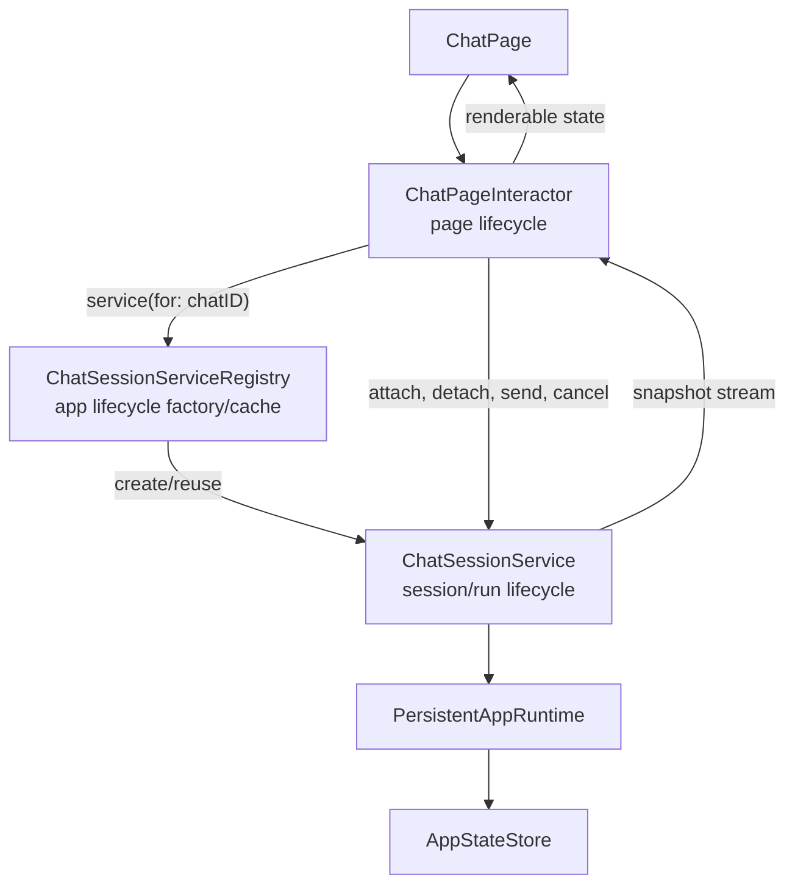
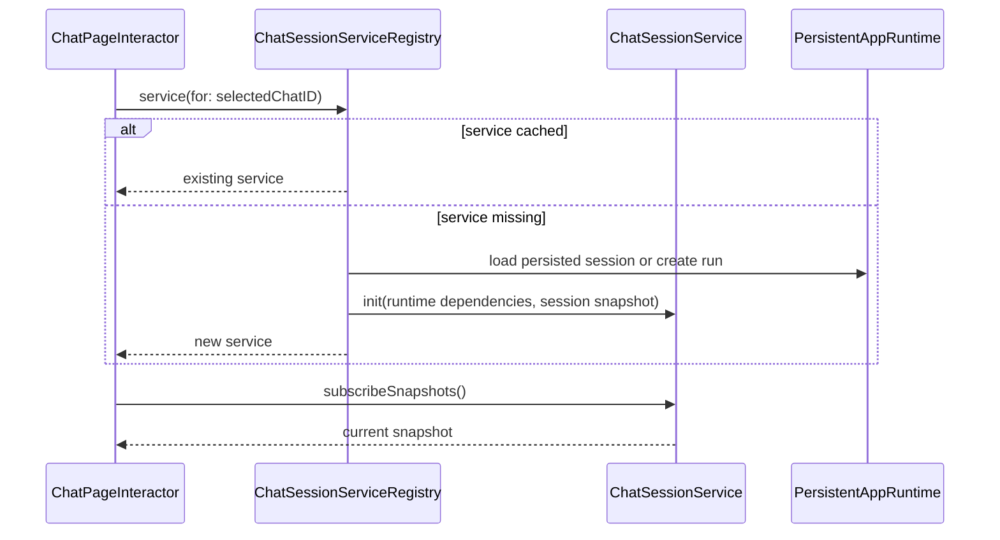

# Chat Session Service Refactor Plan

**Status:** Draft
**Date:** 2026-04-27
**Related Architecture Map:** [Chat Log Runtime Architecture Map](./0005-chat-log-runtime-architecture-map.md)
**Related ADRs:** [ADR-0004](../adr/0004-swiftui-interactor-page-architecture.md), [ADR-0007](../adr/0007-headless-runtime-entrypoint.md), [ADR-0008](../adr/0008-local-app-state-storage.md)

## Purpose

This plan records how to refactor chat execution so page interactors stay tied to the SwiftUI view lifecycle while chat IO and per-chat state live in a persistent service layer.

The current `ChatPageInteractor` is doing too much: it starts runtime work, consumes streams, applies runtime events to the visible transcript, owns running/error state, and reloads session summaries. That was enough for the first chat UI, but it is the wrong ownership boundary for persistent multi-chat behavior.

## Required Architecture Decision

Create an ADR before the implementation refactor.

Candidate title: `Persistent Chat Session Service And UI Subscription Boundary`

The ADR should decide:

1. Whether the per-chat service is an actor, a main-actor observable object, or a split between a background actor and main-actor snapshot publisher.
2. Whether the service consumes direct `streamUserMessage` streams, subscribes through `RuntimeEventHub.observeRunEvents`, or uses a hybrid model.
3. Whether the service is keyed by persisted session ID, runtime run ID, or a dedicated chat instance ID.
4. How dependency injection is scoped across app lifetime, page lifetime, and chat-session lifetime.
5. How services are created, retained, and evicted.
6. How page disappearance differs from explicit user cancellation.
7. How persisted sessions are loaded back into service snapshots after restart or eviction.

## Target Shape



The registry is a factory/cache, not a command facade. The interactor asks the registry for the currently selected chat service, then sends chat commands to that service. This keeps command ownership on the per-chat object and avoids splitting behavior between the registry and the service.

## Dependency Injection Scopes

The refactor should keep dependency injection explicit and scoped by lifetime. A single app-wide container is not enough once chat work can outlive a page.

| Scope | Examples | Owner |
| --- | --- | --- |
| App scope | `PersistentAppRuntime`, app state store, provider settings use cases, `ChatSessionServiceRegistry` | App shell / route context |
| Page scope | `ChatPageInteractor`, selected chat subscription, provider settings panel state, inspector presentation state | `Page(interactor:view:)` |
| Chat session scope | `ChatSessionService`, transcript snapshot cache, active send task, per-chat cancellation handle, runtime event subscription, per-chat error/running state | `ChatSessionServiceRegistry` |

Expected DI flow:

1. The app shell builds app-scope services and injects them into route contexts.
2. `ChatRoutes.registration` creates `ChatPageInteractor` with app-scope dependencies such as the session registry and page-level use cases.
3. `ChatPageInteractor` does not construct per-chat services directly. It asks `ChatSessionServiceRegistry` for a service by chat/session ID.
4. `ChatSessionServiceRegistry` owns chat-session-scoped construction, reuse, and eviction.
5. Each `ChatSessionService` receives a runtime-facing dependency, such as `PersistentAppRuntime` or narrower runtime use-case protocols, plus any per-session policy needed for that chat.

By default, `ChatSessionService` should not receive raw `AppStateStore` or `RuntimeEventHub` dependencies directly. It should go through runtime-level use cases so persistence and event publication stay centralized. The ADR may choose to expose a narrower event observation protocol to the service, but it should avoid creating a second persistence path or a competing event pipeline.

This gives future features a clear place to add per-chat dependencies without expanding the page interactor. For example, context policy, tool permissions, model override state, attachment state, or provider retry policy can be scoped to `ChatSessionService` instead of becoming fields on `ChatPageInteractor`.

## State Ownership Model

The refactor should split state by lifetime and authority. The page interactor owns render state for the current view. A chat session service owns live per-chat state. The registry owns the service cache and summary/index state needed to find or create services.

All loadable state should use `StoreState<Data, Failure: Error>`:

```swift
enum StoreState<Data, Failure: Error> {
    case loading(placeholder: Data? = nil)
    case loaded(Data)
    case error(Failure)
}
```

This keeps UI state explicit and avoids scattered combinations of `isLoading`, optional data, and optional error strings. The placeholder should be used when the UI can keep showing stale data during a refresh.

### Page Interactor State

`ChatPageInteractor` should own only state required to render the current page and route view actions. It can cache the latest snapshot from the selected `ChatSessionService`, but that snapshot is not the authoritative chat log.

Illustrative shape:

```swift
struct ChatPageState: Equatable {
    var selectedChatID: UUID?
    var selectedSnapshot: ChatSessionSnapshot?
    var sessions: StoreState<[ChatSessionSummaryState], ChatPageError>
    var draftText: String
    var providerSettings: ProviderSettingsPanelState
    var inspector: StoreState<PersistedRunInspection?, ChatPageError>
}
```

Interactor-owned state should include:

- selected chat ID,
- local draft text for the visible composer,
- latest selected chat snapshot for rendering,
- sidebar summaries as `StoreState<[ChatSessionSummaryState], ChatPageError>` while the page is visible,
- page-local loading/error state represented with `StoreState` rather than separate loading booleans and error optionals,
- page-local modal and inspector presentation state, and
- subscription handles for the selected service and summary stream.

Interactor-owned state should not include:

- authoritative transcript storage,
- active provider/runtime tasks,
- per-chat running state for chats that are not selected,
- session-scoped context/tool/provider policy,
- retry/backoff state, or
- persistence reconciliation state.

### Chat Session Service State

`ChatSessionService` owns one chat's durable live state. It is the source of truth for the in-memory projection of that chat while the app is running.

Illustrative shape:

```swift
struct ChatSessionSnapshot: Equatable, Sendable {
    var id: UUID
    var title: String
    var transcript: StoreState<[ChatMessageState], ChatSessionError>
    var activeTurnID: UUID?
    var turnState: StoreState<TurnProgressState, ChatSessionError>
    var updatedAt: Date
    var inspectionSummary: StoreState<RunInspectionSummaryState?, ChatSessionError>
}
```

Service-owned state should include:

- session/run ID,
- transcript projection as `StoreState<[ChatMessageState], ChatSessionError>`,
- active turn ID,
- per-chat running and cancellation state through a typed turn `StoreState`,
- per-chat runtime error state as typed service errors,
- in-flight send task or task identity,
- runtime event subscription if the ADR chooses subscription-first delivery,
- context/inspection summary projection for the chat,
- per-chat policy such as model override, context policy, tool permissions, attachment state, or retry policy, and
- a snapshot publisher for attached interactors.

The service may rebuild its snapshot from persisted session data when created. It should persist durable changes through runtime-facing use cases rather than writing raw storage directly by default.

### Chat Session Service Registry State

`ChatSessionServiceRegistry` owns the app-lifetime index of chat services. It should create and reuse services, but it should not become the command handler for individual chat actions.

Illustrative shape:

```swift
actor ChatSessionServiceRegistry {
    private var services: [UUID: ChatSessionService]
    private var summaries: StoreState<[ChatSessionSummaryState], ChatRegistryError>
}
```

Registry-owned state should include:

- cached `ChatSessionService` instances keyed by session/run ID,
- summary/index data needed to list chats and locate services,
- service creation dependencies and factories,
- eviction metadata such as last access time or active subscriber count,
- app-level summary publisher, if sidebar summaries become push-based, and
- creation flow for a new session service.

Registry-owned state should not include:

- transcript mutation logic,
- provider/runtime stream application,
- per-chat cancellation behavior, or
- page selection state.

### Creation And Attachment Flow



New chat creation should follow the same ownership:

1. The interactor handles `.tapNewChat`.
2. The interactor asks the registry to create or return a service for the new chat.
3. The registry coordinates the persisted session/run creation through runtime-facing use cases.
4. The registry constructs the chat-session-scoped service.
5. The interactor selects and subscribes to that service.

This keeps the page in charge of user intent and selection, the registry in charge of service lifetime, and the service in charge of per-chat behavior.

## Responsibility Changes

| Area | Current Owner | Target Owner |
| --- | --- | --- |
| Selected page rendering state | `ChatPageInteractor` | `ChatPageInteractor` |
| Send command routing | `ChatPageInteractor` | `ChatPageInteractor` forwards to `ChatSessionService` |
| Active provider/runtime IO | `ChatPageInteractor` task | `ChatSessionService` task |
| Runtime event application | `ChatPageInteractor.apply` | `ChatSessionService` |
| Per-chat running/error state | Global selected page state | `ChatSessionSnapshot` |
| Transcript cache | Selected page state | `ChatSessionService` |
| Session summary refresh | Explicit interactor calls | Registry/store publisher or service-driven summary invalidation |
| Page disappear behavior | Cancels page tasks | Detaches subscription; chat continues unless explicitly cancelled |

## Refactor Sequence

### Phase 1: ADR

- Add the ADR named above.
- Decide service isolation and event delivery model.
- Define cancellation and eviction rules.
- Update this plan if the ADR changes the target shape.

### Phase 2: Service Contracts

Add contracts without moving the UI yet:

- `StoreState<Data, Failure>`
- `ChatSessionSnapshot`
- `ChatSessionService`
- `ChatSessionServiceRegistry`
- a small subscription API that an interactor can attach to and cancel

The first snapshot should include:

- session ID or run ID,
- messages,
- active turn ID,
- running state,
- error state,
- provider request/context/inspection summary handles if needed by the inspector.

### Phase 3: Runtime Event Ownership

Move event application from `ChatPageInteractor` into `ChatSessionService`.

Acceptance criteria:

- A send in chat A can finish after the UI navigates to chat B.
- Chat A's transcript is updated in the service and persisted state.
- Chat B's visible transcript does not receive chat A events.
- The page can disappear without losing a running chat.

### Phase 4: Interactor Slimming

Refactor `ChatPageInteractor` into a page adapter:

- `onAppear` attaches to the selected service and loads summaries.
- `onDisappear` detaches service subscriptions only.
- `.tapSend` forwards the draft to the selected service.
- `.tapChat(id)` is the public user action for selecting a chat.
- `openSession(id)` remains a private helper if needed, called internally by `handleTapChat`.
- `.tapCancel` explicitly cancels the selected service's active turn.
- provider settings and inspector actions remain page-level until they need their own services.

### Phase 5: Sidebar And Summary Updates

Remove ad hoc sidebar refreshes from read-only flows.

Preferred direction:

- registry or storage layer publishes session summary changes,
- sidebar subscribes to summaries through the interactor while visible,
- per-chat running state can be shown without marking the entire sidebar as loading.

### Phase 6: Tests

Add tests at the service boundary first, then keep interactor tests narrow.

Required tests:

- service continues a response with no interactor attached,
- switching interactor attachment does not move events between chats,
- page disappearance detaches without cancelling the service,
- explicit cancel stops the selected chat service,
- service reloads a persisted session snapshot,
- sidebar summary updates do not require full-list loading on chat selection.

## Documentation Updates

After implementation:

- Update [Chat Log Runtime Architecture Map](./0005-chat-log-runtime-architecture-map.md) from current-state map to accepted service flow.
- Update ADR-0004 only if the core interactor principle changes.
- Add a reference doc if the service contracts become stable enough for future feature work.
